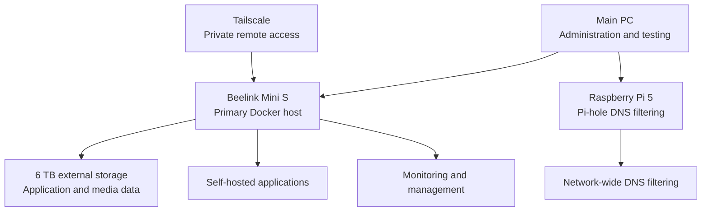

# Personal Homelab Infrastructure

## Overview

This repository documents the design, deployment, security, maintenance,
and troubleshooting of my personal homelab.

I built this environment to gain practical experience with Linux system
administration, Docker, networking, secure remote access, storage management,
monitoring, backups, and self-hosted applications.

The environment primarily runs on a Beelink Mini S, with a Raspberry Pi 5
providing network-wide DNS filtering. I administer the environment from my
main PC and access private services remotely through Tailscale.

> This repository contains sanitized documentation only. Passwords, API keys,
> authentication tokens, public addresses, and other sensitive values are
> excluded.

## Architecture

