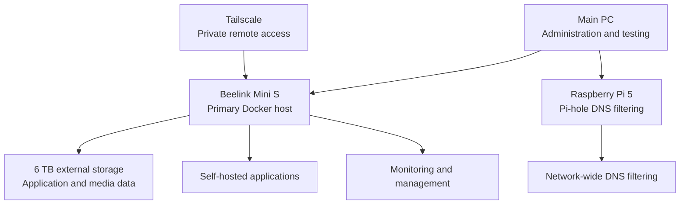

# Personal Homelab Infrastructure

## Overview

This repository documents the design, deployment, security, maintenance,
and troubleshooting of my personal homelab.

I built this environment to gain practical experience with Linux system
administration, Docker, networking, secure remote access, storage management,
monitoring, backups, and self-hosted applications.

The environment primarily runs on a Beelink Mini S, with a Raspberry Pi 5
providing network-wide DNS filtering. I administer the environment from my
main PC and access private services remotely through Tailscale.

> This repository contains sanitized documentation only. Passwords, API keys,
> authentication tokens, public addresses, and other sensitive values are
> excluded.

## Architecture

## Hardware

### Primary Server

| Component | Specification |
|---|---|
| Device | Beelink Mini S |
| Processor | Intel N95 |
| CPU | 4 cores |
| Memory | 8 GB |
| Internal storage | 256 GB |
| External storage | 6 TB |
| Operating system | Ubuntu 24.04.4 LTS |
| Primary workload | Docker containers and self-hosted services |

### Raspberry Pi

| Component | Specification |
|---|---|
| Device | Raspberry Pi 5 |
| Primary service | Pi-hole |
| Purpose | Network-wide DNS filtering and advertisement blocking |

### Main PC

My main PC is used to:

- Connect to the server through SSH
- Configure and maintain applications
- Access administrative dashboards
- Monitor services 
- Test and troubleshoot problems
- Create project documentation

## Software and Services

### Infrastructure and Administration

| Technology | Purpose |
|---|---|
| Docker | Deploys applications in isolated containers |
| Docker Compose | Defines and manages multi-container applications |
| Portainer | Provides web-based container administration |
| Tailscale | Provides private remote access to the homelab |
| Uptime Kuma | Monitors service availability and health |
| Gluetun | Routes selected container traffic through a VPN |
| Mullvad VPN | Provides the VPN connection used by Gluetun |

### Personal Cloud and Security

| Service | Purpose |
|---|---|
| Vaultwarden | Self-hosted password management |
| Nextcloud | Private file storage and cloud services |
| Immich | Self-hosted photo and video management |
| Pi-hole | Network-wide DNS filtering and ad blocking |

### Media Services

| Service | Purpose |
|---|---|
| Jellyfin | Primary self-hosted media-streaming platform |
| Jellyseerr | Manages media requests |
| Navidrome | Provides self-hosted music streaming |
| Sonarr | Manages and organizes television libraries |
| Radarr | Manages and organizes movie libraries |
| Lidarr | Manages and organizes music libraries |
| Bazarr | Manages subtitles |
| Prowlarr | Manages integrations used by media applications |

### Supporting Services

| Service | Purpose |
|---|---|
| PostgreSQL | Provides database services for Immich |
| Redis | Supports Immich caching and background tasks |
| qBittorrent | Download client routed through the VPN container |
| NZBGet | Download-management application |
