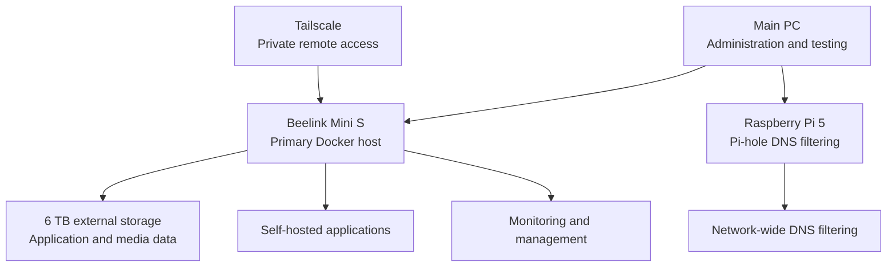

# Personal Homelab Infrastructure

## Overview

This repository documents the design, deployment, security, maintenance,
and troubleshooting of my personal homelab.

I built this environment to gain practical experience with Linux system
administration, Docker, networking, secure remote access, storage management,
monitoring, backups, and self-hosted applications.

The environment primarily runs on a Beelink Mini S, with a Raspberry Pi 5
providing network-wide DNS filtering. I administer the environment from my
main PC and access private services remotely through Tailscale.

> This repository contains sanitized documentation only. Passwords, API keys,
> authentication tokens, public addresses, and other sensitive values are
> excluded.

## Architecture

## Hardware

### Primary Server

| Component | Specification |
|---|---|
| Device | Beelink Mini S |
| Processor | Intel N95 |
| CPU | 4 cores |
| Memory | 8 GB |
| Internal storage | 256 GB |
| External storage | 6 TB |
| Operating system | Ubuntu 24.04.4 LTS |
| Primary workload | Docker containers and self-hosted services |

### Raspberry Pi

| Component | Specification |
|---|---|
| Device | Raspberry Pi 5 |
| Primary service | Pi-hole |
| Purpose | Network-wide DNS filtering and advertisement blocking |

### Main PC

My main PC is used to:

- Connect to the server through SSH
- Configure and maintain applications
- Access administrative dashboards
- Monitor services 
- Test and troubleshoot problems
- Create project documentation

## Software and Services

### Infrastructure and Administration

| Technology | Purpose |
|---|---|
| Docker | Deploys applications in isolated containers |
| Docker Compose | Defines and manages multi-container applications |
| Portainer | Provides web-based container administration |
| Tailscale | Provides private remote access to the homelab |
| Uptime Kuma | Monitors service availability and health |
| Gluetun | Routes selected container traffic through a VPN |
| Mullvad VPN | Provides the VPN connection used by Gluetun |

### Personal Cloud and Security

| Service | Purpose |
|---|---|
| Vaultwarden | Self-hosted password management |
| Nextcloud | Private file storage and cloud services |
| Immich | Self-hosted photo and video management |
| Pi-hole | Network-wide DNS filtering and ad blocking |

### Media Services

| Service | Purpose |
|---|---|
| Jellyfin | Primary self-hosted media-streaming platform |
| Jellyseerr | Manages media requests |
| Navidrome | Provides self-hosted music streaming |
| Sonarr | Manages and organizes television libraries |
| Radarr | Manages and organizes movie libraries |
| Lidarr | Manages and organizes music libraries |
| Bazarr | Manages subtitles |
| Prowlarr | Manages integrations used by media applications |

### Supporting Services

| Service | Purpose |
|---|---|
| PostgreSQL | Provides database services for Immich |
| Redis | Supports Immich caching and background tasks |
| qBittorrent | Download client routed through the VPN container |
| NZBGet | Download-management application |

## Networking and Remote Access

The homelab uses a private-access model for remote connections.

### Local Access

While connected to my home network, I access services using the Beelink
server's local network address and the port assigned to each application.

Examples of these services include:

- Jellyfin
- Immich
- Vaultwarden
- Nextcloud
- Portainer
- Uptime Kuma

Actual network addresses and ports are excluded from this public repository.

### Remote Access

Tailscale provides private remote access when I am away from home. Devices
must be authenticated and connected to my Tailscale network before they can
reach the homelab services.

This allows me to:

- Administer the Ubuntu server remotely
- Connect through SSH
- Access self-hosted applications
- Troubleshoot services away from home
- Avoid intentionally exposing administrative dashboards to the public internet

### DNS Filtering

A Raspberry Pi 5 runs Pi-hole to provide DNS-based filtering across supported
devices on my home network.

Pi-hole is used to:

- Block advertisements and tracking domains
- Monitor DNS requests
- Improve visibility into network activity
- Apply filtering rules across multiple devices

### VPN Routing

Selected Docker containers route their network traffic through Gluetun,
which connects to Mullvad VPN.

This setup provides experience with:

- Container network dependencies
- VPN tunnels
- DNS configuration
- Docker port mappings
- Network troubleshooting
- Service health checks

### HTTPS Status

The environment currently relies on private LAN and Tailscale access.
Implementing HTTPS for browser-based services is a planned security
improvement.

## Security and Reliability

I use several controls to protect, monitor, and maintain the homelab:

- Tailscale for authenticated remote access
- Pi-hole for DNS filtering
- Mullvad and Gluetun for VPN routing
- Vaultwarden for password management
- Uptime Kuma for availability monitoring
- Backups for important application data
- Separate credentials for administrative services
- Regular operating-system and container updates
- Docker health checks for supported applications
- Restricted remote access to administrative dashboards

Passwords, authentication tokens, private addresses, domains, and other
sensitive configuration values are excluded from this public repository.

### Planned Security Improvements

- Implement HTTPS for browser-based services
- Review Docker port exposure
- Improve automated backup verification
- Add storage-capacity alerts
- Document restoration procedures

 ## Problems Solved

Building and maintaining this homelab has required troubleshooting across
Linux, Docker, networking, storage, and application services.

### Storage Capacity

Investigated high storage utilization by reviewing disk usage, identifying
large directories, and determining which application or media data could be
cleaned up or reorganized.

### Failed Indexers

Troubleshot failed Prowlarr indexers and related connectivity problems by
reviewing container logs, application settings, DNS behavior, and VPN
connectivity.

### Container Networking

Investigated communication failures between Docker containers, mapped ports,
VPN-routed applications, and supporting services.

### VPN and DNS Failures

Used container health information, logs, and network testing to diagnose
problems involving Gluetun, Mullvad, DNS resolution, and external connectivity.

### SSH and Remote Access

Configured and troubleshot SSH and Tailscale connectivity for secure remote
server administration.

### Configuration Errors

Reviewed Docker Compose files, application logs, environment settings, and
configuration syntax to identify errors preventing services from operating
correctly.

